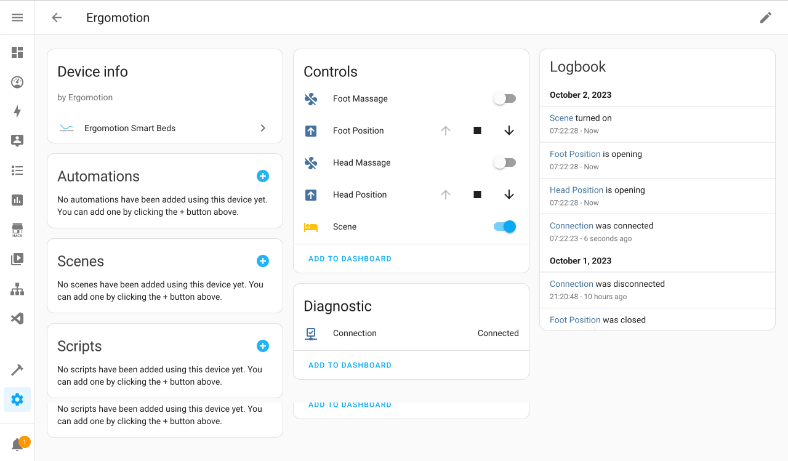
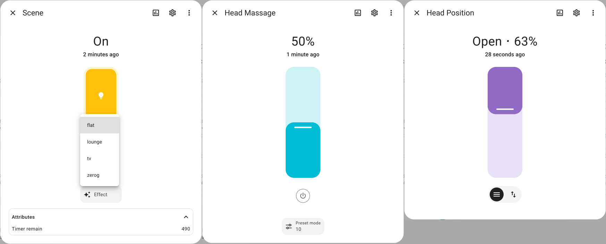

# Ergomotion Smart Beds for Home Assistant

[Home Assistant](https://www.home-assistant.io/) custom component for control [Ergomotion Smart Beds](https://eu.ergomotion.com/) via Bluetooth module.

Tested only with **Remote Style B** (check [mobile app](https://play.google.com/store/apps/developer?id=Ergomotion)).

Supports:

- head and foot actual position with online moving status (`cover` position)
- head and foot massage speed control (`fan` speed)
- massage timeout control (`fan` mode) and remain time counter (`light` attributes)
- scene selection (`light` effects)
- fast flat scene (turn off `light`)





## Installation

[HACS](https://hacs.xyz/) > Integrations > 3 dots (upper top corner) > Custom repositories > URL: `AlexxIT/Ergomotion`, Category: Integration > Add > wait > Ergomotion > Install

Or manually copy `ergomotion` folder from [latest release](https://github.com/AlexxIT/Ergomotion/releases/latest) to `/config/custom_components` folder.

## Configuration

1. Add default [Bluetooth](https://www.home-assistant.io/integrations/bluetooth/) integration. 

2. Configuration > [Integrations](https://my.home-assistant.io/redirect/integrations/) > Add Integration > [Ergomotion Smart Beds](https://my.home-assistant.io/redirect/config_flow_start/?domain=ergomotion)

If you have no MAC address in the setup window, then your HA server can't currently discover any smart bed nearby.

## Bluetooth

Read recommendations here - [Jura Coffee Machines](https://github.com/AlexxIT/Jura).

## Connection

By default, the integration maintains a connection to the bed **for two minutes** after:

- Hass start
- last command
- last manual state update

For manual update use `homeassistant.update_entity` service with `binary_sensor.connection` entity:

```yaml
automation:
  trigger:
    - platform: time_pattern
      seconds: "/110"
  action:
    - service: homeassistant.update_entity
      target:
        entity_id: binary_sensor.aabbccddeeff_connection  # change to your entity_id
```
